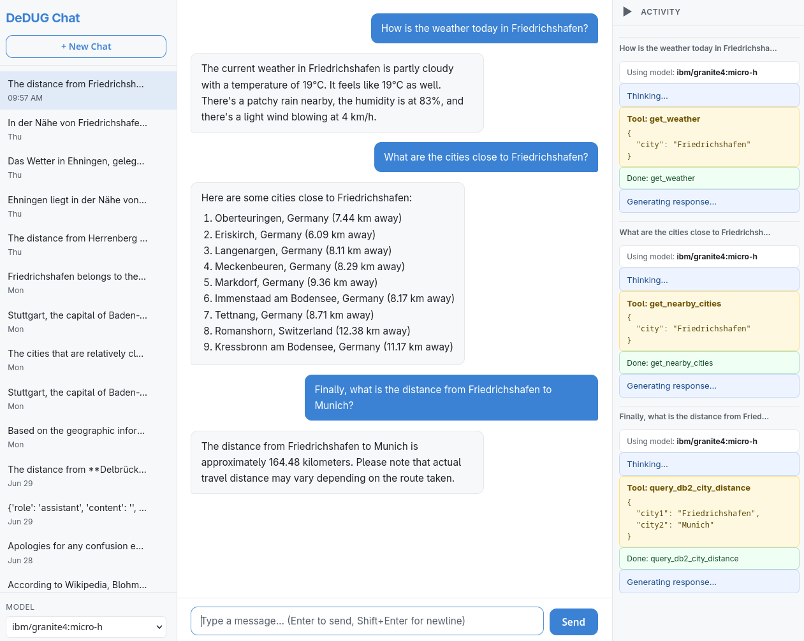

# ochat

**ochat** is a browser-based chat application that runs entirely on your machine.
It connects to a locally-running [Ollama](https://ollama.com/) instance for LLM inference and
supports **tool calling** so the model can fetch live data on your behalf.



## Features

- Streaming chat responses (word-by-word via Server-Sent Events)
- Persistent conversation history (SQLite — survives restarts)
- Conversation sidebar with new-chat and delete buttons
- Model switcher — dynamically lists all models available in your Ollama instance
- Built-in tools:
  | Tool | What it does |
  |---|---|
  | **get_weather** | Current weather for any city via [wttr.in](https://wttr.in) — no API key required |
  | **search_wikipedia** | Wikipedia article summary in English or German |
  | **list_db2_tables** | Lists tables in an IBM Db2 schema (optional — see below) |
  | **query_db2** | Runs a read-only `SELECT`/`WITH` query against IBM Db2 (optional) |
  | **get_nearby_cities** | Returns the closest cities to a given city using vector distance + haversine (optional) |
  | **run_query_city_distance** | Calculates the haversine distance in km between two cities stored in Db2 (optional) |

See my [blog post on using Db2 vector capabilities for geographic search](https://data-henrik.de/2025/11/db2-vector-geo-search/) for details, including the database setup.

---

## Prerequisites

| Requirement | Notes |
|---|---|
| **Python 3.10+** | f-strings, `match`, newer `sqlite3` features |
| **Ollama** | Installed and running locally. Download from [ollama.com](https://ollama.com). |
| **A pulled model** | e.g. `ollama pull llama3.2` — needs tool-calling support |
| **IBM Db2** *(optional)* | Only required if you want to use the Db2 tools. The app starts and works fully without a Db2 connection. |

---

## Installation

```bash
# 1. Clone / download the project
git clone <repo-url> ochat
cd ochat

# 2. Create and activate a virtual environment (recommended)
python -m venv .venv
source .venv/bin/activate   # Windows: .venv\Scripts\activate

# 3. Install Python dependencies
pip install -r requirements.txt
```

> **Note on `ibm_db`**: The `ibm_db` package requires the IBM Data Server Driver to be installed
> on your system. If you do not need Db2 connectivity you can remove the `ibm_db` line from
> `requirements.txt` before running `pip install`. The application will start normally; only
> Db2 tool calls will return an error.

---

## Configuration — `.env`

Copy the example file and fill in the values you need:

```bash
cp .env.example .env
```

Open `.env` and set the variables:

```ini
# ── Ollama ────────────────────────────────────────────────────────────────────
OLLAMA_HOST=http://localhost:11434   # URL of your Ollama instance
DEFAULT_MODEL=llama3.2               # Model pre-selected in the UI

# ── Flask ─────────────────────────────────────────────────────────────────────
FLASK_SECRET_KEY=change-me-in-production

# ── IBM Db2 (optional) ────────────────────────────────────────────────────────
DB2_DATABASE=MYDB
DB2_HOSTNAME=localhost
DB2_PORT=50000
DB2_UID=db2inst1
DB2_PWD=secret
DB2_SCHEMA=                          # Optional default schema for list_db2_tables
```

All Db2 variables default to empty strings; if left unset the Db2 tools will return a
connection error when invoked, but the rest of the application is unaffected.

---

## Running the app

```bash
python app.py
```

Then open **http://localhost:5000** in your browser.

To run in production-style mode (without the Flask debug reloader):

```bash
FLASK_DEBUG=0 python app.py
```

---

## Available tools

The LLM can invoke the following tools automatically when you ask a relevant question:

### Weather — `get_weather`
Fetches current conditions from [wttr.in](https://wttr.in).  
*Example prompt*: "What's the weather like in Berlin?"

### Wikipedia — `search_wikipedia`
Returns a 5-sentence summary from Wikipedia. Supports `language: "en"` (default) or `"de"`.  
*Example prompt*: "Give me a Wikipedia summary of the Eiffel Tower in German."

### Db2 — `list_db2_tables`, `query_db2`, `get_nearby_cities`, and `run_query_city_distance`
Requires a configured Db2 connection (see `.env` above).
- **list_db2_tables**: lists user tables for a schema (defaults to `DB2_SCHEMA` if set).
- **query_db2**: runs a read-only `SELECT` or `WITH` statement; results are capped at 100 rows.
- **get_nearby_cities**: finds the *N* closest cities to a given city. Uses Db2's `vector_distance` function (with Euclidean distance on a stored coordinate vector) to short-list candidates and the `haversine` UDF to calculate exact distances in km. Returns the city name, country, and distance for each result.
  *Example prompt*: "What cities are near Paris?"
- **run_query_city_distance**: calculates the straight-line (haversine) distance in km between two named cities stored in the `cities` table. Returns both city names and the distance.
  *Example prompt*: "How far is Berlin from Madrid?"

> The app starts and runs normally without Db2 credentials. Only requests that trigger these
> tools will return an error message in the chat.

---

## Project structure

```
ochat/
├── .env.example        # Environment variable template
├── .gitignore
├── README.md
├── requirements.txt
├── config.py           # Loads .env, exposes config singleton
├── history.py          # SQLite-backed conversation persistence
├── chat_engine.py      # Ollama tool-calling loop + streaming
├── app.py              # Flask application and API routes
├── tools/
│   ├── __init__.py     # TOOL_DEFINITIONS + call_tool dispatcher
│   ├── weather.py
│   ├── wikipedia.py
│   └── db2.py
└── templates/
    └── index.html      # Single-page chat UI (inline CSS + JS)
```
